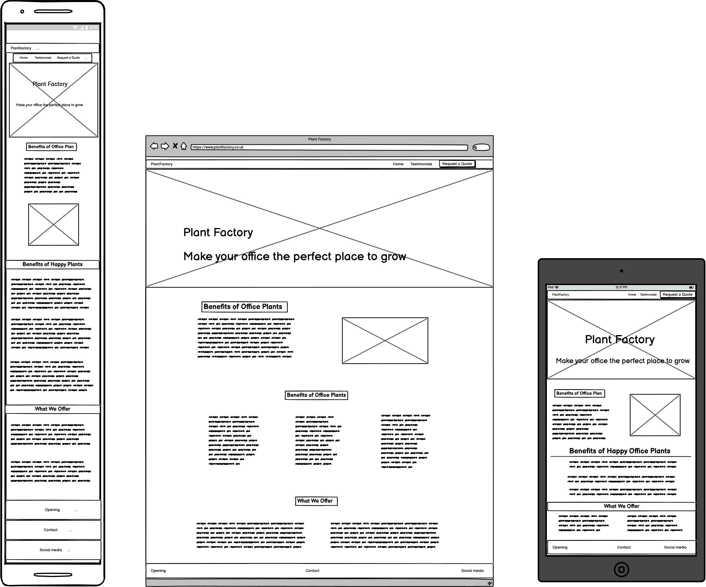
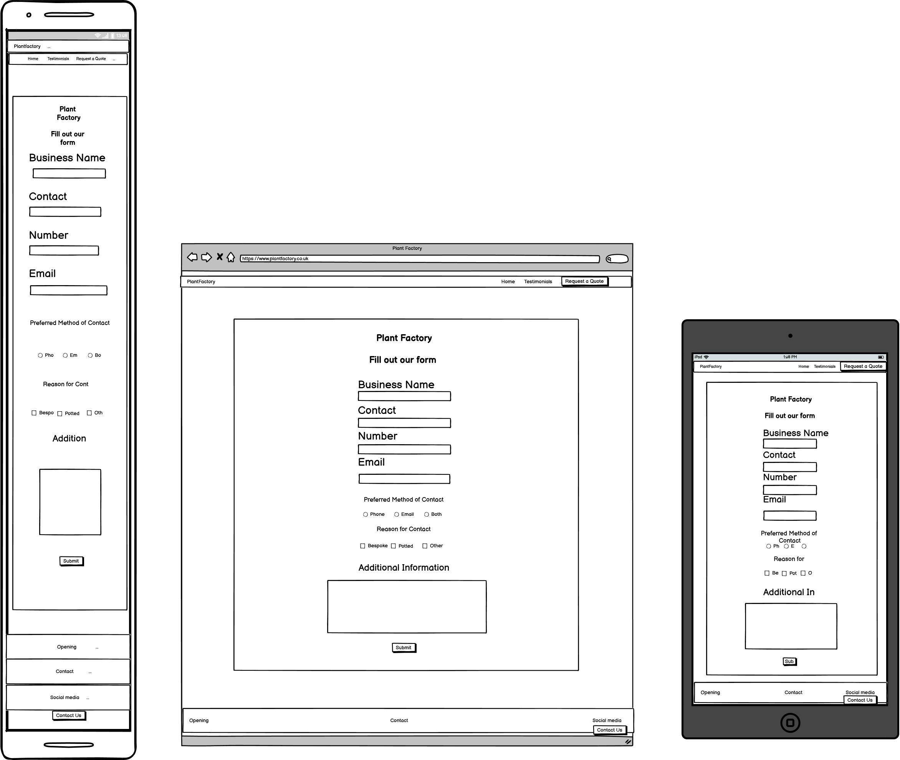

# Plant Factory 

Mock Up  

Link to Live Website 
https://crypticcaroline.github.io/ms1-plantfactory/index.html

GitHub Repo 

## About 
 Plant Factory is a buisness designed at bringing postive change to workplaces in the form of adding more natural elements.  Plant Factory offers both bespoke plant feature building and installant and potted plants/trees of a range of sizes for office place.  Plant factory will visit the buisness in order to asses the sizes needed and if bespoke will design and cater for individual requirements. 
 Plant Factory needed a website to help get new clients and also showcase some of their work.  Plant Factory needed to have contact form so that new and existing clients could reach them easily.   Plant Factory is currently a small company with a small range of website needs,  there is scope for the buisness to grow.  As the buisness grows the website can be adapted to the growing buisness and additional features implamented. 

## Index – Table of Contents

* User Experience (UX) 
* Features
* Designs 
* Technologies Used
* Testing 
* Known Bugs
* Deployment
* Acknowledgements 

## User Experience (UX)
### User Stories

#### Reasons a user may visit the site
* A user looking for office plants to add to the office or work space or buisness.
* A user looking to install a plant feature.
* A user who already has a quotation but wants to get in contact.
* A user doing research on what we offer.
* A user looking to see if we have done previous work.

#### What a user may expect
* Easy to navigate website 
* Good presentation and visually appealling reglardless of screensize.
* Links and functions work in the way expected.
* Information about what Plant Factory does.
* A way to get in contact with Plant Factory.

#### What a user may want
* To be able to find links to social media pages.
* To see examples of previous work carried out.
* To be able to chat with someone online.
* To be able to buy plants online.

#### As a developer / buisness I expect
* To provide information about Plant Factory.
* To provide an easy way for new and existing clients to contact us.
* To showcase some of the work we are proudest of. 
* To provide an easy to navigate website with links that work as expected.
* To showcase customer testimonies and expect customer to read them.
* For clients to be invoked into contacting us for a quote. 

## Designs

### Color -https://mycolor.space/?hex=%232BE67F&sub=1

I have used rich green as my main colour theme for the website. #0b720b this has been paired with an offwhite colour #fdfdfd to ensure good contrast. This will help with Accessibility for visually impaired users. 
This goes with the theme of the website and the buisness.  The buisness moto is making offices greener.  
These colour features several times througout the website which is why I have set a varible in the code.  
I have used the following 

     :root {
    --main-green:#0b720b;
    --off-white:#fdfdfd;
     }
    
This means if the buisness decides at any point to change the key colours they can easily change it in the variable so that they don't need to go through and change every colour individually.     

### Typography 
### Layout -  wire frames  - issue due to typo corrected using dev tools 

### Imagry -  should the hero or pattern image fail there is a background color set
### Mock UP

## Features

### Existing Features

The website has 

### Future Features 

Header - logo -hero images -  
Nav links work -  'active' - hover

Images - alt (screen readers / non loaders).
aria-label - toggles and Accessibility

Buttons consistency - correct links
Responsiveness - media querys?

Footer - social media - opening times - address and contact detais

Home
About Us
benefits
What we Offer

Happy Customers Carousel and Testamonies 

Request a quote (form )

### Future Features 

Navigation collapse for mobile
	

## Technologies Used 
    HTML5 CCS3 

    Libaries 
    Bootstrap,  google fonts,  (mock up)  Balsamic wireframe 
    github git pod

## Testing 

    Nav - links
    Button - Forms - requests
    Footer - social links 
    HTML Validator 
    CSS Validator
### Usability Testing
    Friends /slack 

    issue with landscape testimonal - fix 
### Browser Compatibility
    Tested on Chrome, Firefox, Brave,  Internet Explorer, Microsoft Edge, Safari.
### OS Compatibility
    Tested on iOS , Android 10 and Windows 10.
    Tested for responsivness on Chrome DevTools.
### Performance Testing
    Tested on Developer Tools Lighthouse.

### Testing User Stories
    go through each story what is wanted? 

## Deployment 
### Publishing 
### cloning 
### forking 

## Known bugs 

## Credit

### Code :
    •	Bootstrap library was used to create a responsive design.
    Caroursel taken directly from bootstrap - altered to fit needs 
### Content :
    •	Code : Rebecca Kelsall ---- and ()

README file help 
Code Institute SampleREADME
Code Institute README Template
Markdown Cheatsheet

### Media :

### Inspiration : 

https://makingmoveslondon.co.uk/benefits-of-plants-in-the-office/   
http://planter.co.uk

### Acknowledgements
Thank you ----

