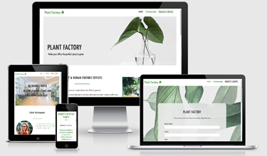
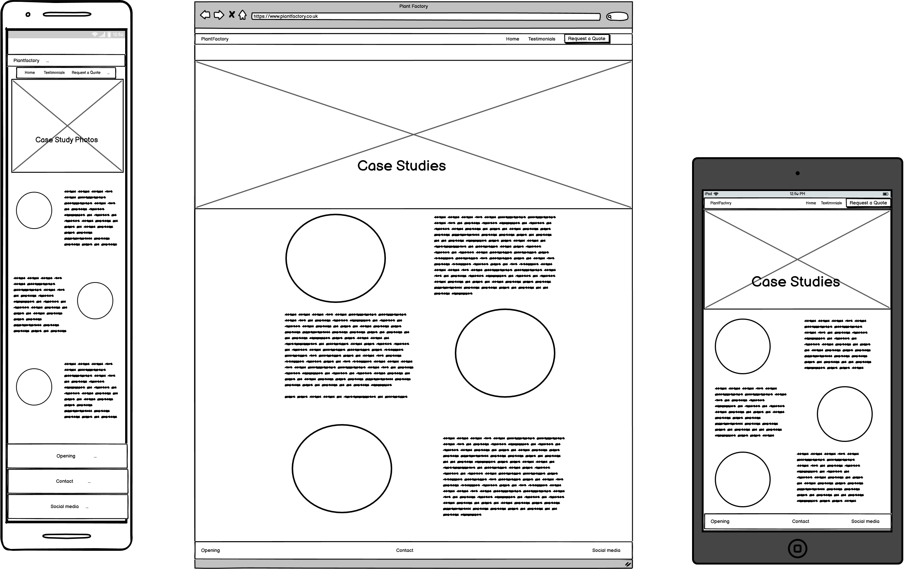
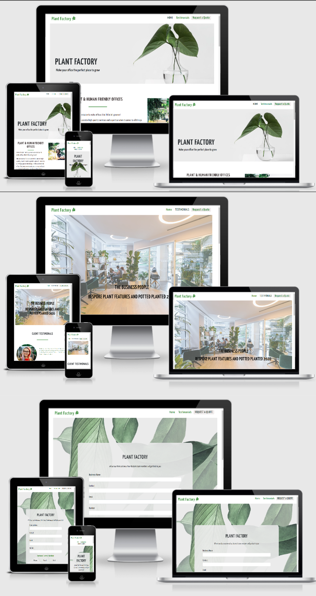
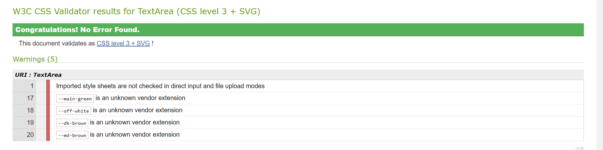
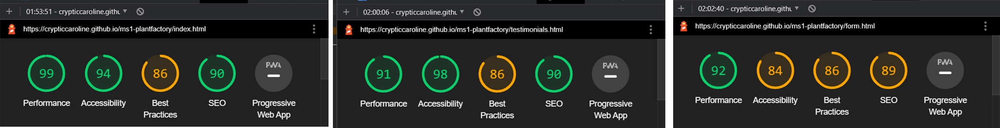
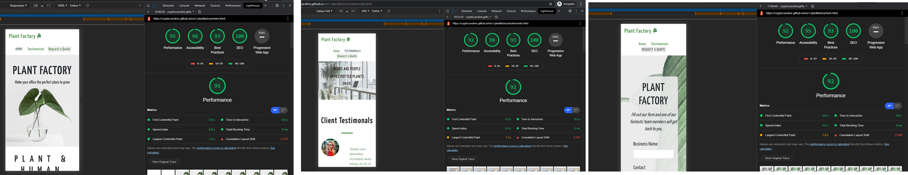

# Plant Factory 

[Link to Live Website](https://crypticcaroline.github.io/ms1-plantfactory/index.html)

[GitHub Repo](https://github.com/crypticCaroline/ms1-plantfactory)

*** 

## About 
 Plant Factory is a business concept created for my MS1 project with Code Institute.
 
   
 Plant Factory is a business dedicated to bringing postive change to workplaces in the form of adding more natural elements. 
 The vast majority of workspaces within the UK do not have any access to natural elements within their workplace.  Having natural elements such as plants can boost postive wellbeing, increase productivity and creat a more appealling place to work. 
 Plant Factory offers both bespoke plant feature and potted plants/trees of a range of sizes for office place.  Plant factory will visit the business to assess the sizes needed.  Currently they do not offer plants to be bought online as they are dealing in larger quantities / larger plants suited to businesses. If a bespoke client Plant Factory will take care of the design and cater for individual requirements. These include large built-in plant walls, islands with trees in the middle and hanging fixtures. 
 
 
 Plant Factory would need to have a website to tell users a little bit about the business, show potential clients what services they offer and showcase some of their current or existing work.  Plant Factory will need to have a contact form so that new and existing clients can reach them easily.   Plant Factory is a small company with a small range of website needs, there is scope for the business to grow.  As the business grows the website can be adapted to the growing business and additional features implemented. 

***

## Index – Table of Contents

* [User Experience (UX)](#user-experience) 
* [Features](#features)
* [Designs](#designs)
* [Technologies Used](#technologies-used)
* [Testing](#testing)
* [Known Bugs](#known-bugs)
* [Deployment](#deployment)
* [Acknowledgements](#credit)

*** 

## User Experience (UX)
### User Stories

#### Reasons a user may visit the site
* A user looking for office plants to add to the office or workspace or business.
* A user looking to install a plant feature.
* A user who already has a quotation but wants to get in contact.
* A user doing research on what we offer.
* A user looking to see if we have done previous work.
* A user showing the site to other people within their business.

#### What a user may expect
* Easy to navigate website 
* Good presentation and visually appealing regardless of screen size.
* Links and functions work in the way expected.
* Information about what Plant Factory does.
* A way to get in contact with Plant Factory.

#### What a user may want
* To be able to find links to social media pages.
* To see examples of previous work carried out.
* To be able to chat with someone online.
* To be able to buy plants online.

#### As a developer / business I expect
* To provide information about Plant Factory.
* To provide an easy way for new and existing clients to contact us.
* To showcase some of the work we are proudest of. 
* To provide an easy to navigate website with links that work as expected.
* To showcase customer testimonies and expect customer to read them.
* For clients to be invoked into contacting us for a quote. 

***

## Designs

### Colour

I have used rich green as my main colour theme for the website. This has been paired with an offwhite colour to ensure good contrast. This will help with Accessibility for visually impaired users. 
This goes with the theme of the website and the business.  The business moto is making offices greener.  
These colour features several times througout the website which is why I have set a varible in the code.  
I have used the following 

     :root {
    --main-green:#0b720b;
    --off-white:#fdfdfd;
    --dk-brown:#0c0606;
    --md-brown: #2a2020;
     }
    
This means if the business decides at any point to change the key colours they can easily change it in the variable so that they do not need to go through and change every colour individually.     

For the rest of the colour scheme, I have kept the range of colours to a minimum using only a few additional colours where needed.  I have used a mid brown and dark brown for some text.  This still ties in with the theme of nature but provides a better design. 
Another reason I have chosen not to use black and white is because it is estimated that 20% of the general population has a form of visual stress (significantly higher percentage in those with disorders such as dylexia) which is a processing perception problem. Which can cause issues with processing text and patterns.  Black on white has been shown as one of the most difficult for sufferers of visual stress to read.  

I initially used https://mycolor.space/ to help me narrow down my design choice after using the colour picker on my hero image.  I had already decided to use green but hadnt decided on the exact shade. Although this was helpful in finding colours that worked well, I chose to alter the palette to my choosing. 

I have purposely not used any red on the website as this may cause issued for people with a red/green colour defiency.

### Typography 

I have used https://fonts.google.com/ for my fonts.  I have chosen to use Yanone Kaffeesatz as my main font throughout the website.  This is a fairly modern looking style that is easy to read at various sizes.  To increase the readability, I have increased the letter spacing in most cases.  
For the use in the headers, I have increased the letter spacing further to make the headings more defined and stand out. I have also used a varity of font weights to make some sections easier to read and stand out. 

I have also used Comic Neue for the testimonies this is because the style is a little more playful and is a welcome change from the font used in the main body of the website. 

I imported the following code into the top of my style.css file

        @import url('https://fonts.googleapis.com/css2?family=Yanone+Kaffeesatz:wght@300;400;500;600;700&family=Comic+Neue:ital,wght@0,300;0,400;1,400&display=swap');

### Call to Action

I made all my call to actions as easy to see as possible. 

* The links in the Nav/Logo are highlighted using a change in background colour and text colour when the mouse is hovered over them.
* Request a Quote is styled as a button to be more inviting for the users to click.  I have used a complete colour switch when the mouse is hovered over the link so that the user can clearly see it is a link.
* Submit link on the form and the Contact Us link in the form have also been styled as a button with a complete colour switch.  The colour used are the 2 main colours for consistency and because the change between the colours is easy to see. 
* The Request a Quote in the main body of index.html and the Contact us in the Footer which takes them to the form. 
* The social links will send the user to the companys social media pages.  They also change colour when hovered over.

### Layout 

* I have used responsive design when creating the website as the page is expanded from a mobile some of the content goes from being stacked to be in adjacent coloumns.  This allows the user to see more of the website on a larger screen. I have also set a Max-Width for the site so on very large screens the content stays neat and is well formatted. 
* I used Bootstraps for the use of the grid system and for the carousel. I used chrome dev tools in the development of the website and altered the column classes in devtools first before implamenting into my code. 
* I have also used a max-width, this is to ensure the content still looks good.  As this is a Business-to-Business company the decisions may not be made by an individual but as a collective.  This means that meetings may take place and the site presented on a larger screen.  The max-width keeps the website looking neat and professional. 
* I have used containers paddings and margins to make sure that the content is not too close together. 

#### Homepage Wire Frame 

#### Testimonial Wireframe

#### Form Wireframe 

***

### Imagery   

Seeing as the business is a concept I had no images to use from the company. I looked for simple and eye-catching designs that mirrored the website ideals when looking for hero images and carousel images. I used a jumbotron for the hero image and I placed an overlay over the top of the carousel. This was to increase the contrast between the imagary and text. 
I used images of people in the testimonals and for the about section.  This was to make the business seem friendly and approachable. These images also grow on hover, this is so the user can see the images more clearly. 
I resized some of the images using tiny.png and cropped and flipped the hero image for use on smaller devices

Image Links - 
* [Hero](https://unsplash.com/photos/x2Tmfd1-SgA)
* [About Image](https://unsplash.com/photos/8FAEyjo3Dek)
* [Testimony Image ](https://unsplash.com/photos/Jnxtlv_Fo14)
* [Testimony Image](https://unsplash.com/photos/HrpYHchKb5Y)
* [Testimony Image](https://unsplash.com/photos/ROJFuWCsfmA)
* [Carousel Images](https://unsplash.com/photos/K86O7q3jddY)
* [Carousel Images](https://unsplash.com/photos/VWcPlbHglYc)
* [Carousel Image ](https://unsplash.com/photos/p_kICQCOM4s)

I also used a pattern background of leaves for the form page and the What we offer section.  This was to tie into the theme of the business and increase visual appeal. 

[Pattern background](https://www.freepik.com/free-vector/mostera-background_4258347.htm#page=2&query=pattern+background+plant&position=46)

Should the hero or pattern image fail there is a background color set so that the colours of the text can still be read. 
The images in body of the website all have alt attributes.  This is to ensure that screen readers can describe the image to the user or if the image fails to load.  This is also to help with ranking of the website. 

### Mockup

***

## Features

#### Universal Features Across the Site

###### Logo and Navigation Bar
The Navigation is at the top of the webpage.  The logo and Nav links all change colour and are highlighted when hovered.  The nav links direct the user to the correct page of the site. When the logo is clicked it will take the user back to the home page.
When the page is active, I used bootstraps class .text-uppercase this causes all the letter to be capitalized and made the text a different colour.  By having both these change it helps to improve the accessibility. 
When on smaller devices the nav goes underneath the logo and it is centered.  For the larger screens, the nav is aligned to the right-hand side of the page and is on the same line as the Logo.  I used white-space:nowrap to stop the (Request a Quote) from splitting when the size of the screen in lowered. The colour of the nav is our 0ff-white and the text is our main green colour

###### Responsiveness

As the page is scaled up and down for different screen resolutions the content stays neat.  This has been achieved using a mixture of media queries and Bootstraps responsive columns.

###### Accessibility

All images and navigations have an alt attributes or aria-label.  This is to make the site easier to use for people with visual impairments by allowing them to navigate the site easily. 
There is high contrast used throughout the design. Header elements have been used in sequence so that the site makes semantic sense to screen readers. 
With links being consistant when hovered over.  I have also set the font to rem so that if somone has they font settings higher for visabilty the font size will increase accordingly. 

###### Footer 

The footer split into 3 sections.  Opening Hours, Contact Info and Social. The colour used for the background is our main-green colour with a reduce opacity as the colour is very bold when at 100%. Theses are stacked on smaller devices and are arranged in 3 coloumns on larger devices.   

The Opening Hours includes the times the office would be open.  The contact details offer alternative ways of getting in contact with the business.  Such as Address, telephone, and email.  The last section Social has links to social media sites using Icons from [Font Awesome](https://fontawesome.com/) When hovered over these change from a white colour to a different shade of green than the background. The social section also includes a Contact Us link that is styled as a button to premote contact to Plant Factory.

##### Meta data

I have included descriptions, author, and keywords into the head element to increase traffic to the website. I have also labeled each page differently so if the client has multiple tabs open it is easy to know which tab is which. 

*** 

#### Features Specific to Pages

###### Homepage 
* Includes a hero image reminder of the name of the company (Plant Factory) and a slogan to entice users to continue reading.  
* About section with information of what Plant Factory does including an image of the owner.  On smaller devices is stacked, and in 2 columns on larger resolutions.
* Benefits sections lists 3 benefits of having more plants in the office.  On smaller devices this is stacked, medium devices have 2 columns, and the last benefit is arranged underneath, and larger devices is in 3 serperate coloumns. 
* What we offer section is displayed stacked on smaller devices and in 2 coloumns on larger screens and offers potential clients the option of potted plants or bespoke features. At the bottom of the option is another link to the contact us form. 

###### Testimonial
* Includes a carousel at the top, paired with an overlay for text colour contrast. The test includes information about the business that the work was carried out for and the type of option they opted for.  Below the carousel is the testimonies. The testimonies are in relation to the images in the carousel and at the bottom of the text is says where each testimony is from. I have scaled the carousel images very large; this is because it is a showcase of the type of work the business has carried out.  
* I have staggered the testimonies on all devices. 

##### Form 
* The Form page consists of the form and universal features only.  
* The form includes fields for the user to enter their business name and contact using - input type="text"
* The input field for email requires the answer to be an email 
* The number must be a number to be valid. 
* Prefernces for contact method is by use of a radio button as there is an option for both to be selected and no errors made causing potential upset to the client. 
* Options they would like to talk about is a checklist.  This is to make sure when the form is submitted it goes to the correct team.
* There is a - textarea - to allow the client to ask any further details.  I have used placeholder text to encourage the user to make any further comments. 
* The submit button is large and changes colour when hovered over.
* The form is stacked for mobile use.  For the larger screens, the radio buttons and check list appear inline.
* The labels are clear as to what should go in the field and all fields are set to required. 

I have set the form to POST with an action of "contact.php" this will not currently go anywhere as github pages is static hosting only. 

### Future Features 

* Nav collapses on mobile
* Has a log in area where clients can chat online with memebers of the team and has the ability to share designs and discuss offers. 
* Has a form submited status to give users peace of mind that the form has been sent correctly and sends the form to Plant Factory email.  
* Create an option for businesses to buy smaller plants online with a way to make online payments. 
    

***

## Technologies Used 

* HTML5 - Mark-up language using semantic structure.
* CCS3 - Cascading style sheet used to style.
* Gitpod.io - for writing the code. Using the command line for committing and pushing to Git Hub
* GitHub - Used to host repository 
* GIT - for version control of the project.

Design 
* [Bootstrap](https://getbootstrap.com/) - For responsive design/carousel - overwriten some coe within my own stylesheet
* [Google fonts](https://fonts.google.com/) - For styling the typography
* [Balsamiq wireframe](https://balsamiq.com/) - To build wireframes in the design phase. 
* [Font Awesome](https://fontawesome.com/) - for social media icons

Testing 
* [HTML Validator](https://validator.w3.org/) - Testing validity of HTML
* [CSS Validator](https://validator.w3.org/) -Testing validity of CSS
* [IE NetREnderer](https://netrenderer.com/index.php)
* [Am I Responsive](http://ami.responsivedesign.is/#) - Checking the responsive nature 
* DEV Tools - Lighthouse

***

## Testing 

* Nav links work and the user is directed to the correct page of the site. 
* Logo takes the user back to the main page.
* Contact us and Request a Quote opens links to Form.
* Hovers over links are clear and not default blue.
* Social links works. 
    
[HTML Validator](https://validator.w3.org/)

[CSS Validator](https://validator.w3.org/)

A few warnings were displayed when using the validator this is because of the varibles I have used to help with the maintenence of the site.  The other error is due to using external style sheets. I am happy with the outcome of this test. 

### Usability Testing

I sent the project to a few of my peers in the slack community and to a few friends within the industry.  I had them check to ensure all links were working and the website was responsive at different screen resolutions.
One of my friends viewed the project in simplified mode and commented that the website was still easy to navigate and displayed clearly. 

A few bugs were identified prior to deployment.  The form was being cut off the bottom on very small screen sizes and the links to social media were not working.  I FIXED these prior to deployment.  By making sure the web addresses were correct and by resizing the form.

    
### Browser Compatibility

Tested on Chrome, Firefox, Brave, Internet Explorer, Microsoft Edge, Safari.
I tested on older version of Internet Explorer, the website works from Internet Explore 9 and onwards, although not all the content is as designed the overall layout means the content is still easy to read and the images are still visable. 
I used [IE NetREnderer](https://netrenderer.com/index.php) to test the older versions. 

### OS Compatibility
Tested on iOS, Android 10, and Windows 10. - Asked a friend with an IPhone that it was working.  
Tested for responsiveness using Chrome DevTools.

### Performance Testing
Tested on the Developer Tools Lighthouse.  This was the first time running through Lighthouse

I maded some changes, such as increasing contrast, adding meta data and making sure my HTML was semantic and this was the results.

### Testing User Stories

* ###### A user looking for office plants to add to the office or workspace or business. 
The user can find the information quickly on the first page of the site that this is something that we offer, the user is given the option to get in contact and can have a look at testimonies and images of work carried out. 
* ###### A user looking to install a plant feature. 
The user can easily see that this is something we offer.   
The user is given the option to get in contact and can have a look at testimonies and images of work carried out previously. 
* ###### A user who already has a quotation but wants to get in contact.
The user can find our contact details in the footer, this includes a phone number, address, and email.  There is also a big button that the user can click to be taken to a seperate page to contact us. 
* ###### A user doing research on what we offer. 
The user can find information about what services we offer on the main page, can then go onto looking at testimonies and images of work we have previously carried out. Each tab has a different description so if the user has more than one tab open them can navigate between them easily. 
* ###### A user looking to see if we have done previous work. 
Easy to navigate to from the main page.  Testiomials clearly seen in the nav bar. 
* ###### A user showing the site to other people within their business.   
Max-width set so if the site is being shown in a meeting or on a larger screen the content still looks presentable. 

*** 

## Deployment 

The project was deployed with the following steps

* Logged into git hub
* Clicked the "Settings" button in the menu aboove the Repository.
* Scroll down the Settings page to the "GitHub Pages" Section.
* Under "Source", click the dropdown called "None" and then select "Master Branch".
* The page will automatically refresh, and a link displaced.  It may take some time for the link to show the website.
* If the page will not load go down to "template" under the "source" and select a template. 
* Scroll back down through the page to locate the now published site link in the "GitHub Pages" section.

### Forking

Forking the GitHub Repository
By forking the GitHub Repository, you can make a copy original repository on our GitHub account.  This means we can view or make changes without making the changes affect the original.

* Log into GitHub and locate the GitHub Repository.
* At the top of the Repository there is a "Fork" button about the "Settings" button on the menu.
* You should now have a new copy of the original repository in your own GitHub account.

### Cloning 

Making a Local Clone

* Log into your GitHub then find the gitpod repository
* Under the repository name there is a button that say "Clone or download" click this.
* If cloning with HTTPS "Clone with HTTPS", copy this link.
* Open Gitbash
* Change the current working directory to the location where you want the cloned directory to be.
* Type git clone, and then paste the URL you copied earlier.

        $ git clone https://github.com/YOUR-USERNAME/YOUR-REPOSITORY
        Press - Enter- Your local clone will be created.
        $ git clone https://github.com/YOUR-USERNAME/YOUR-REPOSITORY
                > Cloning into `CI-Clone`...
                > remote: Counting objects: 10, done.
                > remote: Compressing objects: 100% (8/8), done.
                > remove: Total 10 (delta 1), reused 10 (delta 1)
                > Unpacking objects: 100% (10/10), done.
[Click Here](https://docs.github.com/en/free-pro-team@latest/github/creating-cloning-and-archiving-repositories/cloning-a-repository) for more info on cloning. 

## Known Bugs 
* There was an issue with testimonal when the content was view on a phone in landscape mode- FIX I changed the layout of the page so the content would render better. 
* The text on the carousel takes a moment to snap to uppercase.  This is likely because of the delay in reaching the Bootstrap style sheet. FIX written the follow code directly into my style.css 
         
         .carousel-caption h5, .carousel-caption p {
        color:var(--md-brown);
        font-weight: 600;
        font-size: 1.4rem;
        letter-spacing: 1px;
        text-transform: uppercase;
         }

* When the rem size is increased on a user screen the text on the hero image is lost and the form is cut off form the bottom.  

***

## Acknowledgements

### Credit

* Brian Macharia- Mentor support, guidence, tips and key things to look out for throughout the project. Helping me to check for errors and looking at my code. 
* Matt Rudge - Template for gitpod.io 
* Rob Beaney - for testing and reporting any bugs or issues, helping me to trouble shoot an issue with positioning. 
* Anthony Lomax - for testing and reporting any bugs or issues and giving me feedback on usability.
* Harry Smith - for pointing out issue with carousel text taking a moment to change to uppercase.
* Full Stack Developers WhatApp group (memebers of the codeinstitute slack community) - for taking the time to test the website and point out some padding issues on different resolutions, pointing out the testimonal landscape bug, also for pointing out the social links were not working. 

* [Bootstrap](https://mdbootstrap.com/)  - Carousel used and customised for use in the project. 
* [Code Institute SampleREADME](https://github.com/Code-Institute-Solutions/SampleREADME)
* [Code Institute README Template](https://github.com/Code-Institute-Solutions/readme-template)
* [W3schools](https://www.w3schools.com/) - for various code information and trouble shooting.
* [Google fonts](https://fonts.google.com/) - CDN for the fonts were used in the project.
* [Balsamiq wireframe](https://balsamiq.com/) - To build wireframes in the design phase. 
* [Font Awesome](https://fontawesome.com/) - for social media icons) - CDN for icons used in the project.
* [Unsplash](https://unsplash.com/) Images taken from unsplash - see [Imagery](#imagery) for links.
* [Freepik](https://www.freepik.com/)- pattern background
* [HTML Validator](https://validator.w3.org/) - Testing validity of HTML.
* [CSS Validator](https://validator.w3.org/) -Testing validity of CSS.
* [IE NetREnderer](https://netrenderer.com/index.php)
* [Am I Responsive](http://ami.responsivedesign.is/#) - Checking the responsive nature.
* [Beautifer](https://beautifier.io/) - Allowing me beautify my code.
* [Tiny PNG](https://tinypng.com/) – changing some images to smaller sizes

*** 

### Code:

*  Bootstrap library was used to create a responsive design.
Carousel taken directly from bootstrap - altered to fit needs 

        

        <ol class="carousel-indicators">
            <li data-target="#carouselExampleIndicators" data-slide-to="0" class="active"></li>
            <li data-target="#carouselExampleIndicators" data-slide-to="1"></li>
            <li data-target="#carouselExampleIndicators" data-slide-to="2"></li>
        </ol>
        

            

            
            

            

            
            

            

            
            

        

        <a class="carousel-control-prev" href="#carouselExampleIndicators" role="button" data-slide="prev">
            
            Previous
        </a>
        <a class="carousel-control-next" href="#carouselExampleIndicators" role="button" data-slide="next">
            
            Next
        </a>
        

***

### Content:

Code & Content (not already attributed): Rebecca Kelsall

### Inspiration: 

https://makingmoveslondon.co.uk/benefits-of-plants-in-the-office/   
https://www.plant3r.com/

