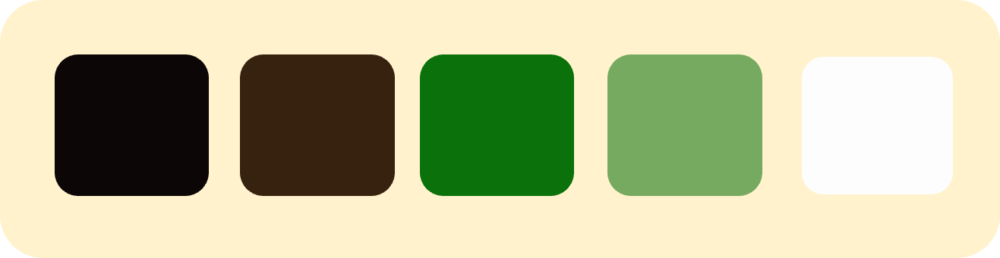

# Plant Factory 

Mock Up  

Link to Live Website 
https://crypticcaroline.github.io/ms1-plantfactory/index.html

GitHub Repo 

## About 
 Plant Factory is a buisness concept created for my MS1 project with Code Institute.  
 Plant Factory is a buisness dedicated at bringing postive change to workplaces in the form of adding more natural elements. 
 The vast majority of workspaces within the UK do not have any access to natural elements within their workplace.  Having natural elements such as plants can boost postive wellbeing, increase productivity and creat a more appealling place to work. 
 Plant Factory offers both bespoke plant feature building and installant and potted plants/trees of a range of sizes for office place.  Plant factory will visit the buisness in order to asses the sizes needed and if bespoke will design and cater for individual requirements. 
 Plant Factory needed a website to help get new clients and also showcase some of their work.  Plant Factory needed to have contact form so that new and existing clients could reach them easily.   Plant Factory is currently a small company with a small range of website needs,  there is scope for the buisness to grow.  As the buisness grows the website can be adapted to the growing buisness and additional features implamented. 

## Index – Table of Contents

* User Experience (UX) 
* Features
* Designs 
* Technologies Used
* Testing 
* Known Bugs
* Deployment
* Acknowledgements 

## User Experience (UX)
### User Stories

#### Reasons a user may visit the site
* A user looking for office plants to add to the office or work space or buisness.
* A user looking to install a plant feature.
* A user who already has a quotation but wants to get in contact.
* A user doing research on what we offer.
* A user looking to see if we have done previous work.
* A user showing the site to other people within their buisness.

#### What a user may expect
* Easy to navigate website 
* Good presentation and visually appealling reglardless of screensize.
* Links and functions work in the way expected.
* Information about what Plant Factory does.
* A way to get in contact with Plant Factory.

#### What a user may want
* To be able to find links to social media pages.
* To see examples of previous work carried out.
* To be able to chat with someone online.
* To be able to buy plants online.

#### As a developer / buisness I expect
* To provide information about Plant Factory.
* To provide an easy way for new and existing clients to contact us.
* To showcase some of the work we are proudest of. 
* To provide an easy to navigate website with links that work as expected.
* To showcase customer testimonies and expect customer to read them.
* For clients to be invoked into contacting us for a quote. 

## Designs

### Colour

I have used rich green as my main colour theme for the website. This has been paired with an offwhite colour to ensure good contrast. This will help with Accessibility for visually impaired users. 
This goes with the theme of the website and the buisness.  The buisness moto is making offices greener.  
These colour features several times througout the website which is why I have set a varible in the code.  
I have used the following 

     :root {
    --main-green:#0b720b;
    --off-white:#fdfdfd;
    --dk-brown:#0c0606;
    --md-brown: #2a2020;
     }
    
This means if the buisness decides at any point to change the key colours they can easily change it in the variable so that they don't need to go through and change every colour individually.     

For the rest of the colour scheme I have kept the range of colours to a minimum using only a few additional colours where needed.  I have used a mid brown and dark brown for some text.  This still ties in with the theme of nature but provides a better design. 
Another reason I have chosen not to use black and white is because it is estimated that 20% of the general population has a form of visual stress (significantly higher percentage in those with disorders such as dylexia) which is a processing perception problem. Which can cause issues with processing text and patterns.  Black on white has been shown as one of the most difficult for sufferers of visual stress to read.  

I initially used https://mycolor.space/ to help me narrow down my design choice after using the colour picker on my hero image.  I had already decided to use green but hadnt decided on the exact shade. Although this was helpful in finding colours that worked well I chose to alter the palette to my choosing. 

I have purposely not used any red on the website as this may cause issued for people with a red/green colour defiency.

### Typography 

I have used https://fonts.google.com/ for my fonts.  I have chosen to use Yanone Kaffeesatz as my main font throughout the website.  This is a fairly modern looking style that is easy to read at various sizes.  To incerase it's readabilty I have increased the letter spacing in most cases.  
For the use in the headers I have increased the letter spacing further to make the headings seem more defined and stand out. I have also used a varity of font weights to make some sections easier to read and stand out. 

I have also used Comic Neue for the testimonies this is because the style is a little more playful and is a welcome change from the font used in the main body of the website. 

I imported the following code into the top of my style.css file

        @import url('https://fonts.googleapis.com/css2?family=Yanone+Kaffeesatz:wght@300;400;500;600;700&family=Comic+Neue:ital,wght@0,300;0,400;1,400&display=swap');

### Call to Action

I made all my call to actions as easy to see as possible. 

* The links in the Nav/Logo are highlighted using a change in background colour and text colour when the mouse is hovered over them.
* Request a Quote is styled as a button to be more inviting for the users to click.  I have used a complete colour switch when the mouse is hovered over the link so that the user can clearly see it is a link.
* Submit link on the form and the Contact Us link in the form have also been styled as a button with a complete colour switch.  The colour used are the 2 main colours for consistency and because the change between the colours are easy to see. 
* The Request a Quote in the main body of index.html and the Contact us in the Footer also open up a new tab -  I have done this so that if the user if still reading something on the main page they won't loose their place on the page. 
* The social links will send the user to the companys social media pages.  They also change colour when hovered over.

### Layout 

#### Homepage Wire Frame 

I have used responsive design when creating the website as the sight is expanded from a mobile first view point some of the content goes from being stacked to be in adjacent coloumns.  This allows the user to see more of the website on a larger screen. I have also set a Max-Width for the site so on very large screens the content stays neat and is well formatted. 
I used Bootstraps for the use of the grid system and for the carousel. I used chrome dev tools in the development of the website and altered the column classes in devtools first before implamenting into my code. 

#### Testimonial Wireframe

#### Form Wireframe 

### Imagry   

Seeing as the buisness is a concept I had no images to use from the company. I looked for simple and eye catching designs that mirrored the website ideals when looking for hero images and carousel images. I used a jumbotron for the hero image and I placed an overlay over the top of the carousel. This was to increase the contrast between the imagary and text. 
I used images of people in the testimonals and for the about section.  This was to make the buisness seem friendly and approachable. These images also grow on hover, this is so the user can see the images more clearly. 
I resized some of the images using tiny.png and also cropped and flipped the hero image for use on smaller devices

Image Links - 
* [Hero](https://unsplash.com/photos/x2Tmfd1-SgA)
* [About Image](https://unsplash.com/photos/8FAEyjo3Dek)
* [Testimony Image ](https://unsplash.com/photos/Jnxtlv_Fo14)
* [Testimony Image](https://unsplash.com/photos/HrpYHchKb5Y)
* [Testimony Image](https://unsplash.com/photos/ROJFuWCsfmA)
* [Carousel Images](https://unsplash.com/photos/K86O7q3jddY)
* [Carousel Images](https://unsplash.com/photos/VWcPlbHglYc)
* [Carousel Image ](https://unsplash.com/photos/p_kICQCOM4s)

I also used a pattern back ground of leaves for the form page and the What we offer section.  This was to tie into the theme of the buisness and increase visual appeal. 

[Pattern background](https://www.freepik.com/free-vector/mostera-background_4258347.htm#page=2&query=pattern+background+plant&position=46)

Should the hero or pattern image fail there is a background color set so that the colours of the text can still be read. 
The images in body of the website all have alt attributes.  This is to ensure that screen readers are able to describe the image to the user or if the image fails to load.  This is also to help with ranking of the website. 

### Mock Up

## Features

#### Universal Features Across the Site

###### Logo and Navigation Bar
The Navigation is at the top of the webpage.  The logo and Nav links all change colour and are highlighted when hovered.  The nav links direct the user to the correct page of the site. When the logo is clicked it will take the user back to the home page.
When the page is active the class .text-uppercase is all in Capital letters and a different colour.  By having both these change it helps to improve the accessabilty
When on smaller devices the nav goes underneath the logo and it centered.  For the larger screens the nav is aligned to the right hand side of the page and is on the same line as the Logo.  I used white-space:nowrap to stop the (Request a Quote) from splitting when the size of the screen in lowered. The colour of the nav is our 0ff-white and the text is our main green colour

###### Responsiveness

As the page is scaled up and down for different screen resolutions the content stays neat.  This has been achieved using a mixture of media queries and Bootstraps responsive columns.

###### Accessibility

All images and navigations have an alt attributes or aria-label.  This is to make the site easier to use for people with visual impairments by allowing them to navigate the site easily. 
There is high contrast used throughout the design. Header elements have been use in sequence so that the site makes semantic sense to screen readers. 
With links being consistant when hovered over. 

###### Footer 

The footer split into 3 sections.  Opening Hours, Contact Info and Social. The colour used for the back ground is our main-green colour with a reduce opacity as the colour is very bold when at 100%. Theses are stacked on smaller devices and are arranged in 3 coloumns on larger devices.   

The Opening Hours includes the times the office would be open.  The contact details offer alternative ways of getting in contact with the buisness.  Such as Address, telephone and email.  The last section Social has links to social media sites using Icons from [Font Awesome](https://fontawesome.com/) When hovered over these change from a white colour to a different shade of green than the background. The social section also includes a Contact Us link that is styled as a button to premote contact to Plant Factory.

# Future Features 

Buttons consistency - correct links
Responsiveness - media querys?

Footer - social media - opening times - address and contact detais

Home
About Us
benefits
What we Offer

Happy Customers Carousel and Testamonies 

Request a quote (form )

### Future Features 

Navigation collapse for mobile
	

## Technologies Used 
    HTML5 CCS3 

    Libaries 
    Bootstrap,  google fonts,  (mock up)  Balsamic wireframe 
    github git pod

## Testing 

    Nav - links
    Button - Forms - requests
    Footer - social links 
    HTML Validator 
    CSS Validator
### Usability Testing
    Friends /slack 

    issue with landscape testimonal - fix 
### Browser Compatibility
    Tested on Chrome, Firefox, Brave,  Internet Explorer, Microsoft Edge, Safari.
### OS Compatibility
    Tested on iOS , Android 10 and Windows 10.
    Tested for responsivness on Chrome DevTools.
### Performance Testing
    Tested on Developer Tools Lighthouse.

### Testing User Stories
    go through each story what is wanted? 

## Deployment 
### Publishing 
### cloning 
### forking 

## Known bugs 

## Credit

### Code :
    •	Bootstrap library was used to create a responsive design.
    Caroursel taken directly from bootstrap - altered to fit needs 
### Content :
    •	Code : Rebecca Kelsall ---- and ()

README file help 
Code Institute SampleREADME
Code Institute README Template
Markdown Cheatsheet

### Media :

### Inspiration : 

https://makingmoveslondon.co.uk/benefits-of-plants-in-the-office/   
http://planter.co.uk

### Acknowledgements
Thank you ----

